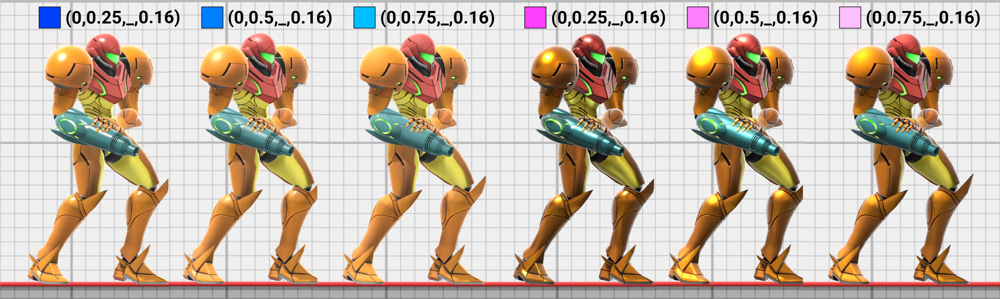

+++
title = "Model Brightness"
+++
Custom models in Smash Ultimate often appear brighter than expected. 
This page explains the two main sources of overly bright models and potential fixes.

## Albedo Color
### Explanation
<figure class="figure">
    
    <figcaption class="figure-caption text-center">Note how the model appears brighter than the col map's color in the shaded squares.</figcaption>
</figure>

The model's [col maps](/textures/col/) determine its overall albedo or base color. A col map brightness of roughly 75% will appear white in game. Albedo colors brighter than 75% will start to clip and lead to excessive bloom.  The [wikipedia albedo page](https://en.wikipedia.org/wiki/Albedo) has a diagram with common real world albedo values that also tend to work well in Smash Ultimate. Real world example of surfaces that reflect approximately 75% of incoming light are paper and some white paints.

### Fixes
As a general rule, keep albedo below 75% brightness. This means the colors in col maps, diffuse maps, and emi maps should be darker than 
(180, 180, 180) in RGB or (0.75, 0.75, 0.75) in float. An easy way to lower the texture brightness is to use a levels adjustment in an image editor. 
Lower the output brightness until the brightest part of the texture is below 75% brightness.

## Specular Highlights
### Explanation
<figure class="figure">
    
    <figcaption class="figure-caption text-center">Different PRM (metalness, roughness, ambient occlusion, specular) values with ambient occlusion left unchanged.</figcaption>
</figure>
Specular reflections are another common source of overly bright models and are the hardest to control. 
Specular reflections in Smash Ultimate try to be energy conserving, meaning that objects never reflect more light than they receive. 
In practice, specular highlights appear darker as the roughness increases since the same amount of light is reflected from a larger area. 
Decreasing roughness focuses the specular highlight, making it appear brighter.

The GGX function used for specular in Smash Ultimate is prone to having bright highlights, especially for metallic materials with low roughness values. This clipping in bright regions occurs even without bloom. This effect is easiest to see in the [PRM demo](/textures/prm/), which doesn't contain any post processing. 

### Fixing Metallic Materials
Metallic materials use the albedo color from the col map as the specular color. In practice, col maps are often much brighter than the recommended specular value of 0.16. Lowering the metalness will use a blend of the col map and PRM alpha channel, which can produce darker but less saturated highlights. 

The decrease in apparent saturation from lowering metalness may not always be desired. The only reliable way to produce saturated highlights without the risk of being too bright is to increase roughness. Roughness values above 0.7 are unlikely to cause clipping such as in the comparison of Samus above.

### Fixing Non Metallic Materials
The most common cause of overly bright highlights for non metallic materials is setting the specular map too high. The PRM alpha channel is scaled differently than many other PBR applications and games, so a reasonable starting value is 0.16 or lower. See the [PRM](/textures/prm/#specular-alpha) page for details. Increasing roughness can also make non metallic specular appear darker but tends to be less of an issue than for metallic materials.
