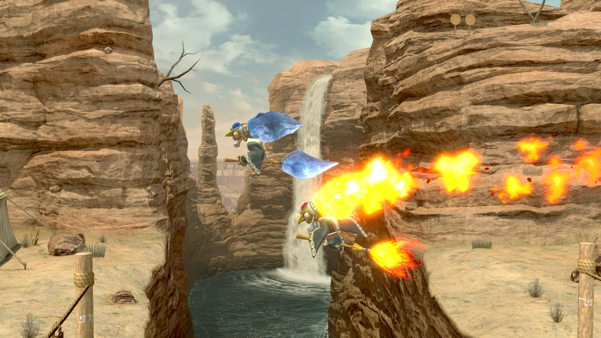

+++
title = "Transparency"
aliases = ["transparency"]
weight = 1
+++

Smash Ultimate uses a number of different techniques to simulate transparent or translucent surfaces. 
Transparency effects are controlled using the [BlendState0](https://github.com/ScanMountGoat/Smush-Material-Research/blob/master/Material%20Parameters.md#Blend-State) 
and [CustomVector0](https://github.com/ScanMountGoat/Smush-Material-Research/blob/master/Material%20Parameters.md#Custom-Vectors) material parameters.
[Alpha blending](#alpha-blending) is the most costly but provides the most control over layering. [Alpha testing](#alpha-testing) is cheap to compute 
but uses a hard cutoff threshold between opaque and fully transparent pixels. [Alpha sample to coverage](#alpha-sample-to-coverage) is similar to alpha testing but 
uses pixelated dithering patterns to support more levels of transparency.

Due to hardware constraints such as low memory bandwidth and limited computing power, these techniques are 
only approximations. Each technique has different tradeoffs in terms of quality and performance. 
Avoid using transparency effects at all when possible for best performance in game. The more layers of transparent or semitransparent objects, 
the more work the game needs to do to render the scene.

## Alpha Blending

<figure class="figure">
    
    <input type="radio" id="opaquePass" name="fireIcePass" value="opaquePass">
    <label for="opaquePass">Opaque Pass</label>
    <input type="radio" id="alphaPass" name="fireIcePass" value="alphaPass">
    <label for="alphaPass">Alpha Pass</label>
    <input type="radio" id="combined" name="fireIcePass" value="combined" checked>
    <label for="combined">Combined</label>
</figure>

Alpha blending can simulate the appearance of transparent or translucent materials such as water, glass, smoke, etc. 
A background color called the "destination color" or "dst color" is blended with a foreground color called the "source color" or "src color". The effect is very similar to layer blend modes in Gimp or Photoshop. 

The above image shows examples of alpha blending on the Gerudo Valley stage for Kotake (ice) and additive alpha blending for Koume (fire). 
The opaque pass shows the scene before drawing any meshes with transparency effects. The alpha pass shows just the transparent meshes. The combined result shows the final rendered image 
with post processing applied.

### Alpha Blending Blend Modes 
The alpha blending parameters are controlled by BlendState0 in the materials. The material's source factor 
and destination factor are controlled by the first and third value for BlendState0, respectively. 

See the [BlendState0 documentation](https://github.com/ScanMountGoat/Smush-Material-Research/blob/master/Material%20Parameters.md#Blend-State) for information on additional blending factors.

Materials that use one of the blending presets will likely want to find a material without alpha testing. This prevents unwanted harsh transitions from fully transparent to fully opaque when the model's alpha falls below the threshold.

### Alpha Blending Presets
| Preset | Source Color | Destination Color | Description |
| --- | --- | --- | --- |
| Opaque | One | Zero | Opaque with no alpha blending. The material may still have alpha testing. |
| Additive | One | One | Add the source and destination color for effects like fire, lasers, or spotlights. |
| Alpha Blending (premultiplied<sup><a href="#fn1" id="ref1">1</a></sup>) | One | One Minus Source Alpha | Transparency blending for effects like glass, ice, or thin cloth. |
| Alpha Blending | Src Alpha | One Minus Source Alpha | Transparency blending for effects like glass, ice, or thin cloth. |
| Black | Zero | Zero | A hack to render the model as black (0,0,0). The material may still have alpha testing. |

<sup id="fn1">1. Not all shaders properly support premultiplied alpha. Use in game materials with the premultiplied BlendState0 settings.</sup>

## Alpha Testing
<figure class="figure">
    
    <input type="radio" id="battlefieldOpaque" name="battlefieldPass" value="battlefieldOpaque">
    <label for="battlefieldOpaque">Opaque Pass (no alpha test)</label>
    <input type="radio" id="battlefieldAlpha" name="battlefieldPass" value="battlefieldAlpha">
    <label for="battlefieldAlpha">Alpha</label>
    <input type="radio" id="battlefieldCombined" name="battlefieldPass" value="battlefieldCombined" checked>
    <label for="battlefieldCombined">Combined</label>
</figure>

Alpha testing skips rendering any pixels that have an alpha value less than a certain threshold. The texture's alpha channel acts as a mask to "cut out" transparent regions of the model. This avoids the sorting issues with alpha blending but can only be used for making regions of a model completely opaque or completely transparent. This works well for hair, leaves, or other materials that would 
have significant sorting issues with alpha blending and don't require being partially transparent. 

The above image shows examples of alpha testing on the Battlefield stage. Note that leaves are in the opaque pass despite having transparency. 
This is fine since alpha testing doesn't depend on render order like alpha blending. With alpha testing disabled in the shaders, the leaves render the same as other opaque meshes. 
The combined result shows the final rendered image with alpha testing enabled and post processing applied.

Alpha testing is hardcoded into certain shaders with a threshold of 0.5. Adjusting the first value of 
CustomVector0 to 1.0 effectively disables alpha testing because the texture alpha will be clamped to 1.0. 

```glsl
// Don't render any pixels with texture alpha less than 0.5.
// The texture alpha is usually from the col map.
float alpha = max(texture.a, CustomVector0.x);
if (alpha < 0.5)
    discard;
```

## Alpha Sample to Coverage
<figure class="figure">
    
    <figcaption>An example of alpha sample to coverage for ZSS's hair. Note the pixelated dithering patterns.</figcaption>
</figure>

Alpha blending provides smooth blending but is prone to sorting issues. Alpha testing doesn't have any sorting issues but can only render parts of a model as fully opaque or fully transparent. Alpha sample to coverage represents transparency by sampling fragments or pixels based on their alpha.

A 50% transparent white surface and a 50% black surface with normal alpha blending will produce the expected result of gray. 
Alpha testing will only display one of the surfaces due to the alpha threshold that is applied. 
Alpha sample to coverage will render roughly 50% of the pixels as black and roughly 50% of the pixels as white. 
From a distance, the overall effect is a surface that looks roughly gray. 
Like alpha testing, this effect doesn't have any sorting issues but can look noticeably grainy due to the game only rendering at 1080p.

Alpha sample to coverage works best for translucent surfaces with lots of intersections that won't work well with other techniques like hair modeled with lots of 2D planes. Many games use a similar technique for LOD transitions or hiding objects blocking the camera. It's cheaper to render than alpha blending and creates a smoother transition than simply toggling the visibility.

## Render Order
Like layers in Photoshop, the render order for meshes matters for alpha blending to work correctly. 
Alpha testing and alpha sample to coverage are order independent and don't require a specific render order.
Opaque meshes should use the _opaque pass to be rendered first. 
Meshes with alpha blending should use _far or _sort to ensure they layer on top of the opaque meshes.
The _near render pass tag is a special case for transparent meshes that should render without any bloom applied.

The order in which different meshes for a model are rendered depends on the shader label. The tag at the end of the shader label 
splits the meshes into different rendering passes. For example, all meshes with "_far" will render before any meshes with "_sort" 
regardless of the parent model. In general, meshes with alpha blending should use "_sort", and all other meshes should use "_opaque".  

1. _opaque
2. _far
3. _sort
4. [*bloom pass*](../../post_processing/#bloom)
5. _near
6. [*color grading pass*](../../post_processing/colorgradinglut/)

<script type="text/javascript">
    const opaquePass = document.getElementById("opaquePass");
    const alphaPass = document.getElementById("alphaPass");
    const combined = document.getElementById("combined");
    const fireIceImg = document.getElementById("fireIceImg");

    function fireIceRadios() {
        if (opaquePass.checked) {
            fireIceImg.src = "fire_ice_opaque.jpg";
        }
        if (alphaPass.checked) {
            fireIceImg.src = "fire_ice_sort.jpg";
        }
        if (combined.checked) {
            fireIceImg.src = "fire_ice_final.jpg";
        }
    }

    opaquePass.onclick = fireIceRadios;
    alphaPass.onclick = fireIceRadios;
    combined.onclick = fireIceRadios;

    const battlefieldOpaquePass = document.getElementById("battlefieldOpaque");
    const battlefieldAlpha = document.getElementById("battlefieldAlpha");
    const battlefieldCombined = document.getElementById("battlefieldCombined");
    const battlefieldImg = document.getElementById("battlefieldImg");

    function battlefieldRadios() {
        if (battlefieldOpaquePass.checked) {
            battlefieldImg.src = "battlefield_no_alpha_test.jpg";
        }
        if (battlefieldAlpha.checked) {
            battlefieldImg.src = "battlefield_alpha.jpg";
        }
        if (battlefieldCombined.checked) {
            battlefieldImg.src = "battlefield_final.jpg";
        }
    }

    battlefieldOpaquePass.onclick = battlefieldRadios;
    battlefieldAlpha.onclick = battlefieldRadios;
    battlefieldCombined.onclick = battlefieldRadios;
</script>