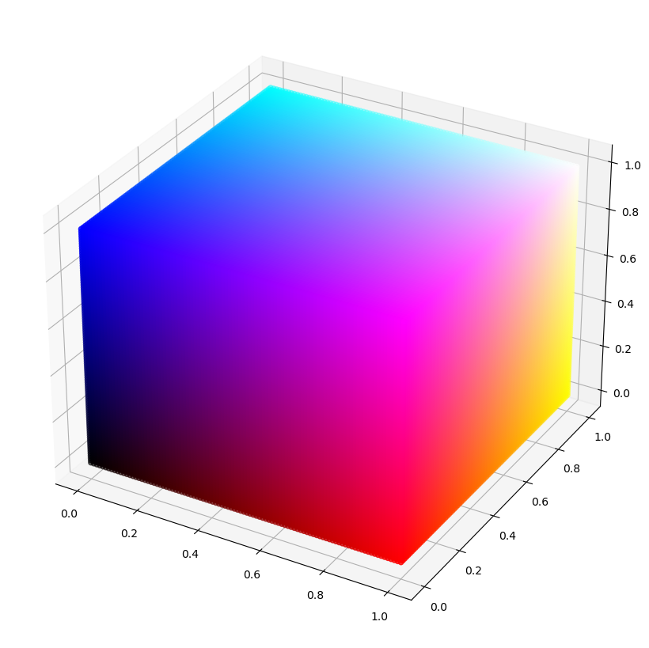

+++
title = "Color Grading Lut"
aliases = ["colorgradinglut"]
weight = 0
+++

The normal and battlefield forms for each stage have a 3D LUT (lookup table) texture to add color grading to the rendered image. The same technique is used for the [snapshot filters](snapshot). The 3D texture is a lookup table, so each input RGB color on the screen is mapped to its corresponding output color. The <a href="https://docs.unrealengine.com/en-US/RenderingAndGraphics/PostProcessEffects/UsingLUTs/index.html" target="_blank">Unreal Engine Docs</a> have a good description of how a 3D LUT can be used to perform color grading.

<figure class="figure col">
    
    <figcaption class="figure-caption text-center">The texture for the neutral color grading LUT above. Each of the 16 layers are separated into individual 16x16 slices for display.</figcaption>
</figure>

## Explanation
A color grading LUT texture transforms the pixel colors based on the input pixel's *color* rather than the input pixel's *position* on the screen. 
A LUT texture can replace all the green pixels with red, set all pixels to black, desaturate the image, etc. A LUT texture can't change the pixels in the top left corner to red 
or apply any sort of textured overlays or borders since the LUT only knows the input pixel's color. The following sections start with a simple gradient map, which can be described as a 
1D LUT, and move towards the more powerful 3D LUTs used in Smash Ultimate.

### 1D LUT
<figure class="figure col">
    
    <figcaption class="figure-caption text-center">A grayscale adjustment with its corresponding 3D LUT (top) and gradient map (bottom).</figcaption>
</figure>

A one dimensional LUT texture takes a single value (usually luminosity) as input and maps it to an output RGB color. The effect is similar to a gradient map 
or color ramp adjustment in an image editor. Any effect that can be achieved with a 1D lut such as a gradient map or color ramp can be achieved with a 3D lut as well.
The above image shows an example of a gradient map or color ramp and the corresponding 3D color grading LUT texture. 

<figure class="figure col">
    
    <figcaption class="figure-caption text-center">A fake metal effect with its corresponding 3D LUT (top) and gradient map (bottom).</figcaption>
</figure>

### 3D LUT
A 3D LUT takes three values (usually RGB) instead of one as input and maps them to an output RGB color. Rather than being a single strip like a color ramp or gradient map, 
3D LUT textures define a volume of colors with RGB values corresponding to the XYZ axes. This enables more complex effects like any combination of HSL/HSV adjustments, RGB curves, levels, exposure, etc.

<figure class="figure row">
    

        
        <figcaption class="figure-caption text-center">A dense neutral RGB LUT</figcaption>
    

    

        
        <figcaption class="figure-caption text-center">A 16x16x16 neutral RGB LUT</figcaption>
    

</figure>
The images above shows a neutral or identity LUT. Each color like black or cyan has a position in 3D space determined by its RGB values. Placing the same color at that position in the LUT 
results in no change to the final image. A 256x256x256 pixel LUT maps each of the 16,777,216 possible RGB colors for an 8-bit image to an output color.

Specifying all colors in a 256x256x256 LUT would require 64 MB of memory! In practice, the in game LUT textures are only 16x16x16 and require only 16 KB of memory. 
This poses a problem since not all of the 16,777,216 possible input RGB colors have a corresponding point in the LUT. This is handled by interpolation, so if a color isn't present in the LUT, 
it takes a combination of neighboring points in the LUT weighted by how close they are to the input point.

## Editing 3D LUTs
A useful property of color grading LUTs is that color grading applied to the LUT will also apply to the final image. Simply apply the adjustments to a neutral color grading LUT and then save the result. A tool for creating color grading LUTs is available on the <a href="https://github.com/ScanMountGoat/Smush-LUT" target="_blank">Smush LUT Github repository</a>.

## Examples
<figure class="figure">
    
    <figcaption class="figure-caption text-center">The result of editing the color_grading_lut.nutexb for Dreamland GB using a gradient map. The 16 slices of the LUT are displayed on the top of the image.</figcaption>
</figure>