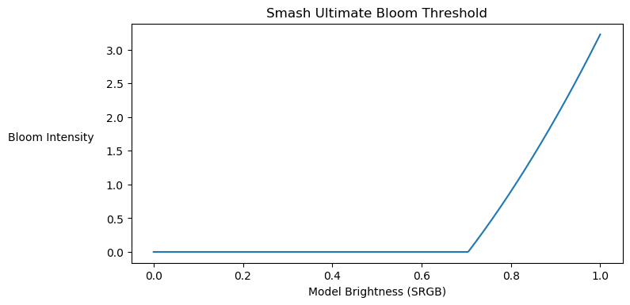

+++
title = "Post Processing Passes"
aliases = ["postprocessing"]
weight = 0
+++
<style>
    .pixelated {
        -ms-interpolation-mode: nearest-neighbor;
        image-rendering: pixelated;
    }
</style>
<figure class="figure">
    
    <figcaption class="figure-caption text-center">From left to right: the base image, the bloom contribution, the image after adding bloom, and the final image after applying the color grading LUT (sepia).</figcaption>
</figure>
Smash Ultimate contains several post processing steps that grealy impact the final look of the image after all the models and effects are rendered. Post processing does not affect the color of UI elements such as stock icons and character portraits.

- Rendering
    - Render models  
    - Render effects  
- Post Processing
    - Add bloom 
    - [Color Grading LUT](colorgradinglut)
    - Additional post processing
- UI Elements

## Bloom 
Bloom adds a glow around bright parts of the image. Any pixel in the frame that is brighter than a certain threshold contributes to bloom. The brighter the pixel, the more intense the bloom. The bloom threshold is calculated as follows. 
```glsl
float componentMax = max(max(inputColor.r, max(inputColor.g, inputColor.b)), 0.001);
float scale = max(0.925 * -0.5 + componentMax, 0.0);
vec3 bloomColor = inputColor.rgb / componentMax * scale * 6.0;
```

The graph below demonstrates the bloom intensity for different brightness values. The brightness threshold is roughly 75%, so any pixels with a brightness of 75% or higher will have some blooming. The graph only shows input values in the range 0.0 to 1.0, but its normal for models to have rendered brightness values much higher than 1.0 due to specular highlights, bright lighting, or certain material parameters.


## Code Sample
The post processing shader code translated to GLSL is listed below. This is shader code is also used for Cross Mod's rendering.

```glsl
vec3 GetPostProcessingResult(vec3 linear)
{
    // Convert to sRGB before applying the LUT.
    vec3 srgb = pow(linear, vec3(0.454545));
    vec3 result = srgb * 0.9375 + 0.03125;

    // Apply the color grading LUT.
    result = texture(colorGradingLut, result.rgb).rgb;

    // Brighten the overall image. 
    result = (result - srgb) * 0.99961 + srgb;
    result *= 1.3703;

    // Convert back to linear.
    result = pow(result, vec3(2.2));
    return result;
}
```