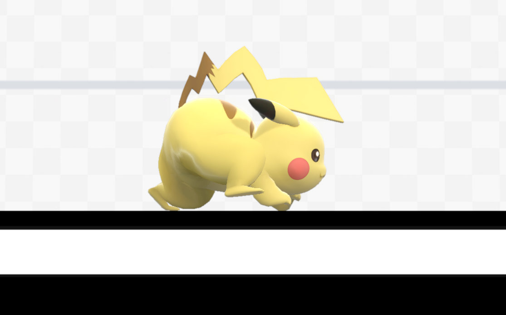
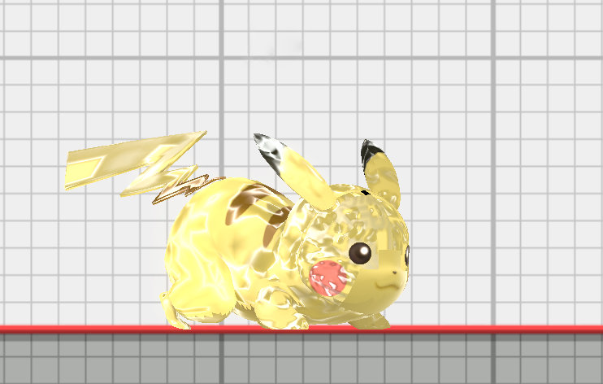

+++
title = "Renormal Materials"
weight = 5
+++
A small number of materials in game have material labels that begin with the "RENORMAL_" prefix like "RENORMAL_skin_pikachu_001". This special prefix instructs the game to recalculate the normals during animation for any meshes assigned to that material. Recalculating normals can reduce shading artifacts on meshes with heavy deformations such as eliminating shading artifacts on Pikachu's crawling animation. This technique isn't enabled for all meshes to save on performance. Recalculating normals will override any custom normals in the numshb file. Renormal materials have no benefits for meshes without vertex skinning such as most stage meshes.

<figure class="figure">
    
    <input type="radio" id="pikachuNoRenormal" name="pikachu" value="pikachuNoRenormal" checked>
    <label for="pikachuNoRenormal">Crawl</label>
    <input type="radio" id="pikachuRenormal" name="pikachu" value="pikachuRenormal">
    <label for="pikachuRenormal">Crawl (Renormal)</label>
</figure>

The model.adjb file contains precomputed triangle adjacency information for select meshes from the model.numshb. The adjacency information specifies the adjacent faces for each vertex to allow the game to calculate smooth vertex normals by averaging the normals calculated from the vertex positions of each adjacent face.

<figure class="figure">
    
    <figcaption>Renormal materials with missing entries in the model.adjb.</figcaption>
</figure>

Meshes with materials with the "RENORMAL_" prefix but no entry in the model.adjb will have broken normals in game. Note the broken normals in the screenshot above. SSBH Editor can automatically detect this and provides ways to easily create a missing model.adjb or add missing entries to an existing model.adjb.

