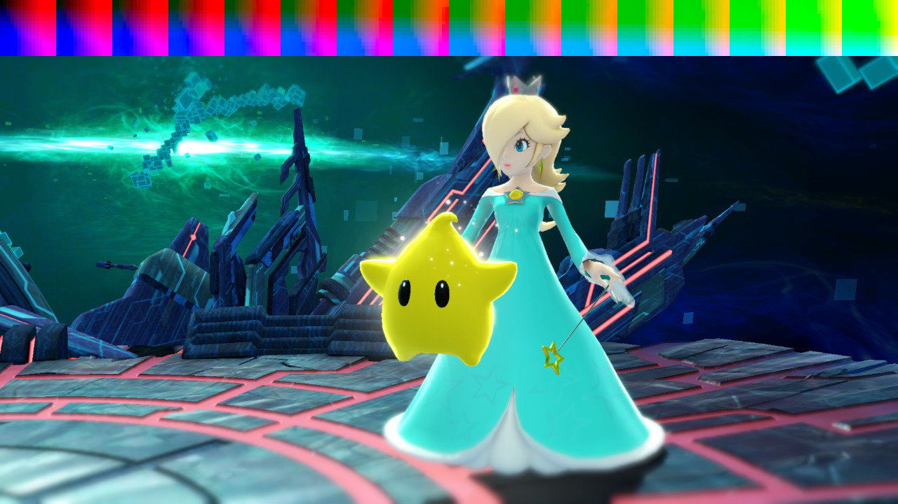
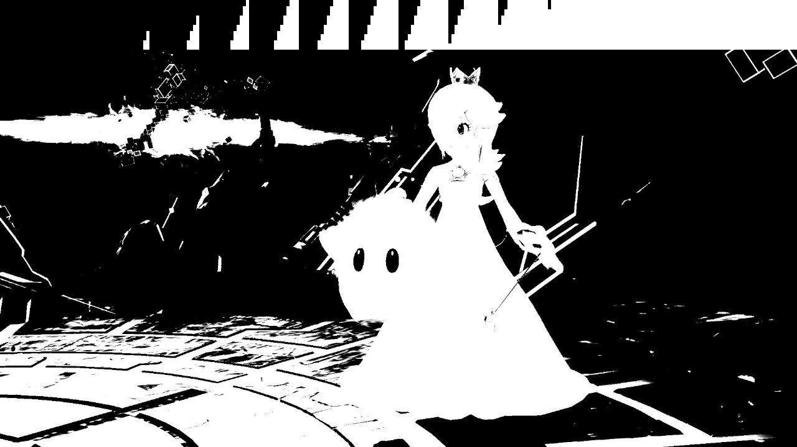

+++
title = "Snapshot Filters - WIP"
aliases = ["snapshot"]
weight = 1
+++
## No Filter 

## Close Up

## Vivid
**snapshot/lut/ss_filter_highsaturation.nutexb**

## Clear

## Green
**snapshot/lut/ss_filter_greenish.nutexb**

## Scarlet
**snapshot/lut/ss_filter_pinkish.nutexb**

## Shadow

## Sepia
**snapshot/lut/ss_filter_sepia.nutexb**

## Retro

## Soft
**snapshot/lut/ss_filter_pastel.nutexb**

## Comic

## Manga

## Shock
**snapshot/lut/ss_filter_reverse.nutexb**

## Two-Tone (Black)
**snapshot/lut/ss_filter_bilevel1.nutexb**

## Two-Tone
**snapshot/lut/ss_filter_bilevel2.nutexb**

## Two-Tone (White)
**snapshot/lut/ss_filter_bilevel3.nutexb**

