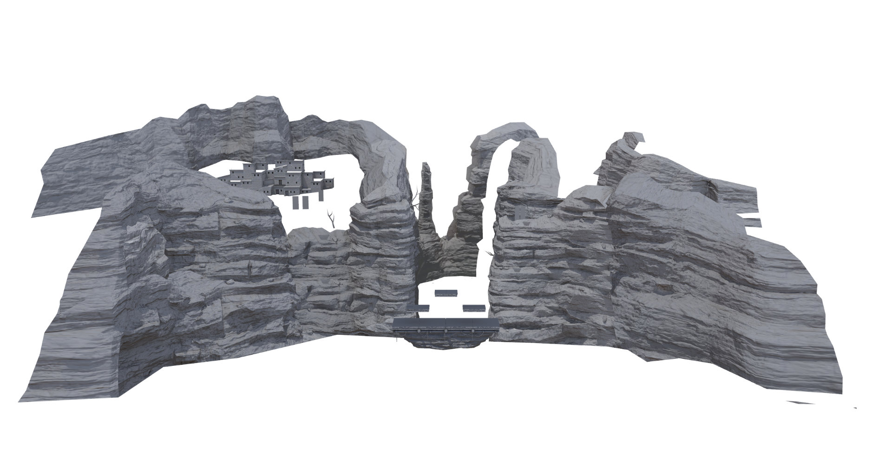

# Baked Lighting (Texture9)
Baked lighting maps store precalculated diffuse lighting and shadows for stages. 

Like ambient occlusion maps, these maps use the bake1 UVs to assign each part of the model to a unique part of the texture. The bake1 UVs can be easily generated in modeling programs like Blender using automatic UV unwrapping algorithms.

## Baked Lighting Channels
Baked lighting maps contain color data, so they should be saved with sRGB formats. sRGB formats have names that end in _SRGB.
When rendering in programs such as Maya or Blender, set the baked lighting maps to Color, sRGB, etc to ensure they are properly
gamma corrected. Failing to use an sRGB format will result in the textures being too bright and looking washed out.

### Ambient Diffuse Lighting (RGB)
<figure class="figure">
    
    <figcaption class="figure-caption text-center">The baked lighting maps (Texture9) for Gerudo Desert's battlefield form.</figcaption>
</figure>

The RGB values are multiplied by 8.0, which allows storing lighting intensities 
much higher than 1.0 in a standard 8 bits per channel image at the cost of precision. The ambient lighting from the baked lighting maps 
is not affected by ambient occlusion from PRM maps.  

### Shadows (Alpha)
The alpha channel masks or occludes the direct lighting, so an alpha value of 0.0 will have no direct lighting and 
appear to be in shadow. The alpha channel is not scaled like the RGB channels.
