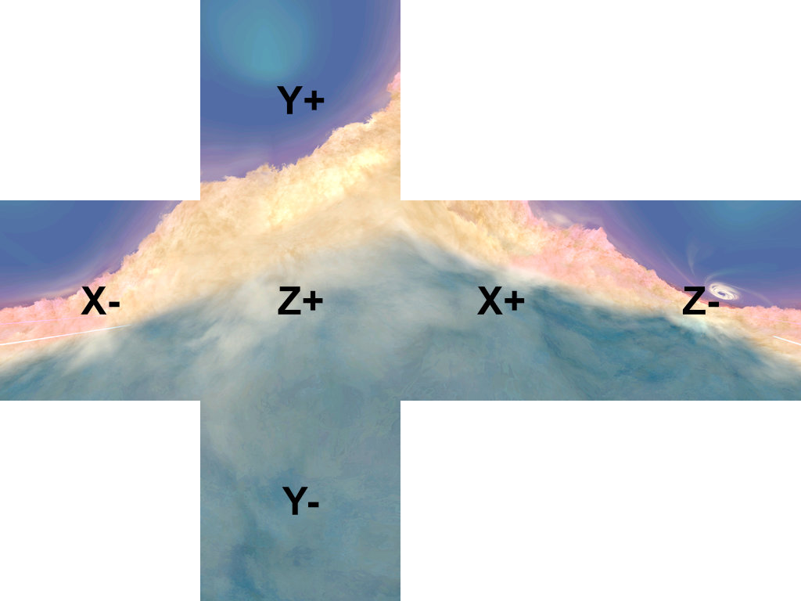

+++
title = "Diffuse Cube (Texture8)"
weight = 4
aliases = ["difcube"]
+++
Diffuse cube maps are used for texturing skyboxes such as the stage editor backgrounds or for effects that wouldn't be possible with traditional texture coordinates such as the galaxy under Rosalina's dress.  

Click and drag on desktop or touch and drag on mobile to orbit the camera in the demo below. Switch between a sphere and cube 
to see the impact of different geometry on the resulting reflections.

    

        <canvas id="imgCanvas"></canvas>
        <form>
            

                <input type="radio" name="shape" id="sphere" value="sphere" checked>
                <label for="sphere">Sphere Mesh</label>
            

            

                <input type="radio" name="shape" id="cube" value="cube">
                <label for="cube">Cube Mesh</label>
            

        </form>
    

    

## Diffuse Cube Map Channels
### Color (RGB)
The RGB color of the diffuse cube map is used to determine the model's color. Diffuse cube map materials aren't completely shadeless, but the final color is mostly determined by the cube map color.

{{ demo(path="/javascript/difcube.js")}}