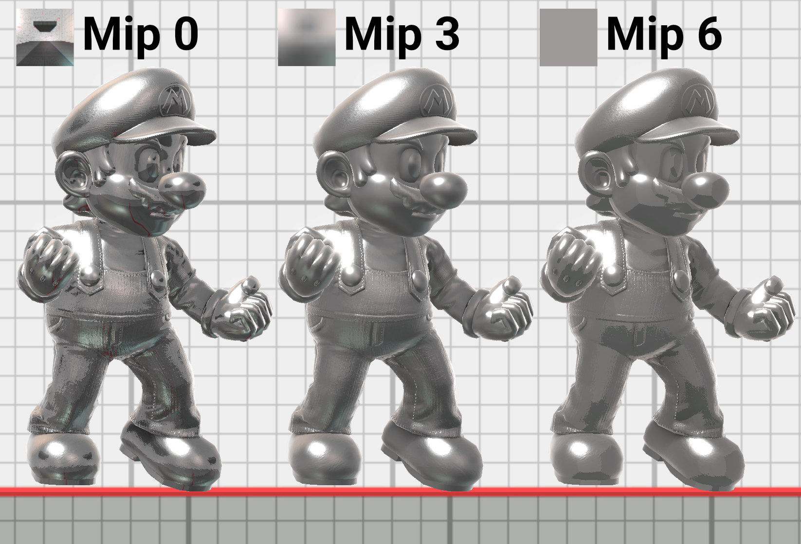
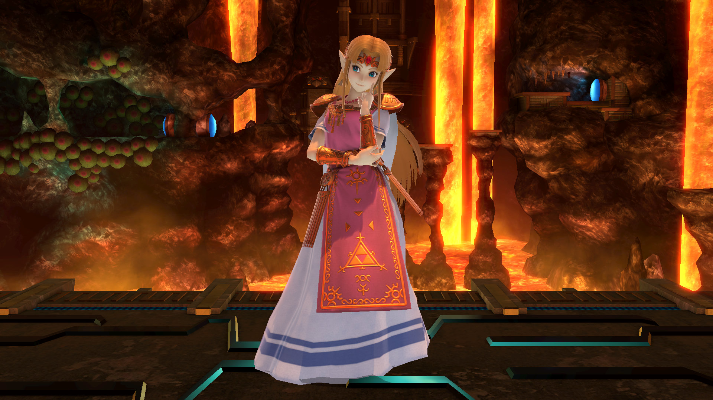

# Specular Cube (Texture7)
Specular cube maps simulate the specular reflections of a model's environment. 
Each stage has its own cube map for specular reflections that can be accessed from materials as 
the special value "#replace_cubemap". Specular cube maps can also use cube maps in the model folder 
for special effects that don't vary between stages similar to [diffuse cube maps](../difcube/).

## Specular Roughness 
<figure class="figure">
    
    <figcaption>Cube map mip levels for the metal box material. Note how smaller mipmaps have a special "blur" effect.</figcaption>
</figure>

Unlike normal cube map textures, specular cube maps have mipmaps. The mipmaps simulate the 
appearance of environment reflections at different roughness levels. Stage cube maps are typically 
64x64 pixels. The base mipmap is the full 64x64 pixels and corresponds to the detailed reflections for a roughness of 0.. 
The last mipmap has a size of 1x1 and simulates the blurry reflections for a roughness of 1.0. Roughness values in between 0 and 1 
blend between mip levels to create appropriately detailed or blurry reflections. 

The actual conversion from PRM roughness to the mip level accessed from the cube map is shown below.
This creates a smooth curve from the base mipmap at a roughness of 0.0 to the smallest mipmap at a roughness of 1.0.
```glsl
float RoughnessToLod(float roughness) {
    // Applies a curves adjustment to roughness.
    // Clamp roughness to avoid divide by 0.
    float r = max(roughness, 0.01);
    float r2 = r * r;
    return log2((1.0 / r2) * 2.0 - 2.0) * -0.4545 + 4.0;
}
```

### HDR Texture Formats
<figure class="figure">
    
    <input type="radio" id="sdr" name="zeldaCube" value="sdr">
    <label for="sdr">SDR</label>
    <input type="radio" id="hdr" name="zeldaCube" value="hdr" checked>
    <label for="hdr">HDR Floating Point</label>
</figure>

For best results, specular cube maps should use floating point formats like BC6UFloat since they can encode HDR (high dynamic range) lighting data. 
This gives improved lighting quality when used with PBR materials like in Smash Ultimate. Floating point cube maps can achieve similar quality to an HDRI in Maya or Blender. Specular cube maps in Smash Ultimate do not affect diffuse lighting, however. Note the more vivid reflections in the armor in the demo above when using an HDR format that supports colors brighter than 1.0.

## Creating Specular Cube Maps - WIP
The base mip level can be baked using traditional methods for creating cube maps. 
The mip levels should be not created by hand and must be generated by an appropriate tool to create accurate results.

## Limitations
Materials in Smash Ultimate can only reference a single stage specific cube map at a time using the "#replace_cubemap" value. 
This means the lighting will only be correct for the single point in space used to bake the cube map. Stage models can use 
their own model specific cube maps to improve the accuracy of the reflections. This doesn't benefit models that appear on multiple stages like fighters or items.  

The floating point format used for HDR lighting improves lighting quality at the cost of greatly increased file sizes. Attempting to increase the cube map size beyond 64x64 may cause memory and stability issues in graphically demanding scenarios. Note that cube map resolution mostly affects materials with low roughness values, since rough surfaces will use higher mip levels with smaller dimensions.

<script type="text/javascript">
    const hdr = document.getElementById("hdr");
    const sdr = document.getElementById("sdr");
    const cubeImg = document.getElementById("cubeImg");

    function imgRadios() {
        if (hdr.checked) {
            cubeImg.src = "zelda_cube_hdr.jpg";
        }
        if (sdr.checked) {
            cubeImg.src = "zelda_cube_sdr.jpg";
        }
    }

    hdr.onclick = imgRadios;
    sdr.onclick = imgRadios;
</script>