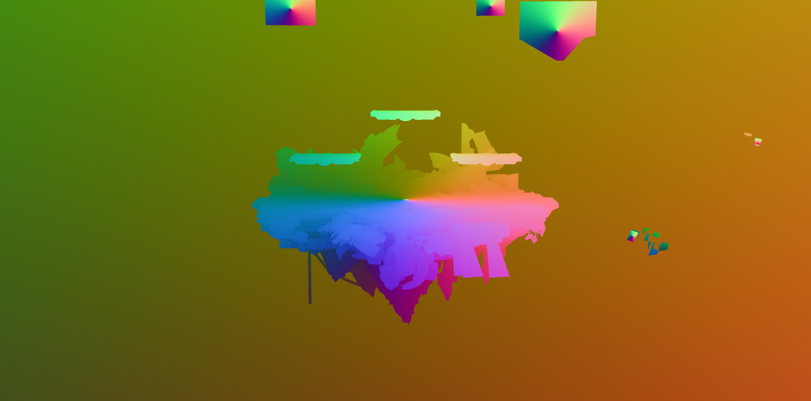
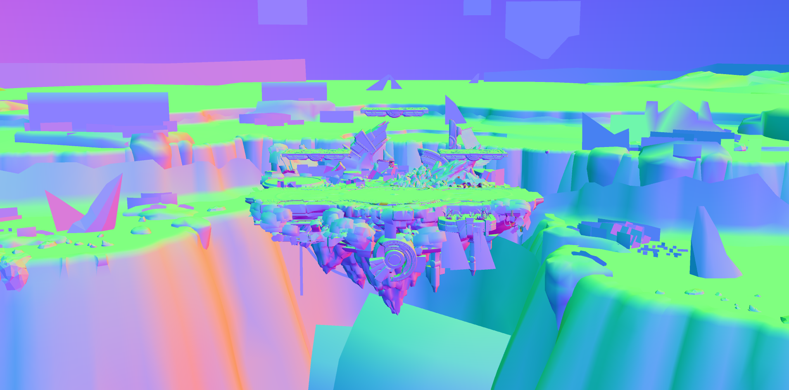
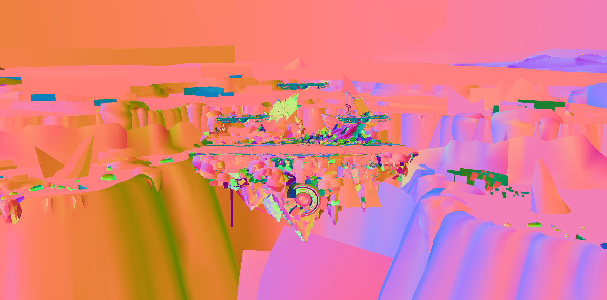

# Vertex Attributes
## Position0

The XYZ components of the Position0 attribute contain the positions of a vertex in object space. Displaying positions as RGB colors using the same technique used for displaying vertex normals creates a colorful visualization. Note how the colors meet at a single point for each object. Object space defines vertex positions relative to the origin point of the object. 

## Normal0

The XYZ components of the Normal0 attribute contain the vertex normal that define the orientation of a surface. The vertex normal is critical for calculating the shading for a surface based on lights, materials, and other properties. The screenshot above shows the Normal0 attribute values for the Battlefield stage.

Vertex normals are direction vectors and not colors. These vectors often contain floating point values that can't be directly displayed as a color like negative numbers. One approach to visualize vertex normals like in the screenshot above is to scale the XYZ values into the 0.0 to 1.0 range and interpret the XYZ values as RGB colors. Surfaces that point up have a positive Y component and display as green. Surfaces the point right have a positive X component and display as red. Surfaces that point towards the viewer have a positive Z component and display as blue. Other orientations display as some combination of red, green, and blue. 

## Tangent0

Tangents and bitangents are used for rendering [normal maps](../../textures/nor/) and [anisotropic specular](../../materials/hair-materials/). The tangent vector is the XYZ components of the Tangent0 attribute. The bitangent vector is generated from the tangent vector in the shaders, so there is no way to directly control the bitangent vector. 

Similar to vertex normals, tangents are sometimes visualized as colors. Tangents are calculated using vertex normals and texture coordinates, so they don't have an intuitive mapping to RGB colors like vertex normals. Looking at a color visualization of tangents may help identify potential problems with normals or normal map rendering such as surfaces appearing inverted or identifying seams. Tangents are not directly editable like vertex positions or texture coordinates. Problems with tangents indicate a problem with the model itself usually due to bad topology, vertex normals, or UV maps. 